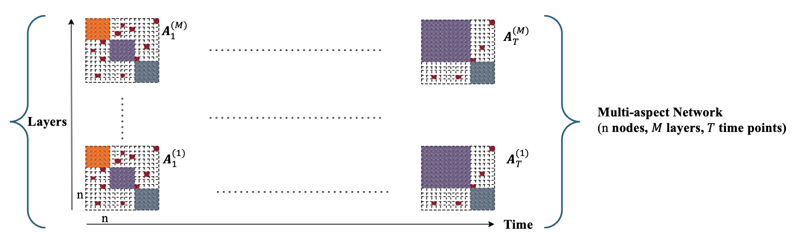

# Community Detection in Multi-Aspect Functional Brain Networks: Robust Tensor Decomposition Approach

This repository includes codes to run Community Detection in Multi-Aspect Functional Brain Networks as described in [[1]](#1). Although the paper focuses on EEG networks, the method can be applied to any type of multi-Aspect networks. A multi-aspect network can be modeled as follows:

## Usage

Please see `demo_CoDMART.m` under the main folder.
Please run the m-file `run_me_first.m` before running the demo.

## Installation

Once you download the repo, you need also to download the Tensors toolbox [[2]](#2)

## References

<a id="1">[1]</a> Al-sharoa, E., Alwardat, M., & Aviyente, S. (2025). Community Detection in Multi-Aspect Functional Brain Networks: Robust Tensor Decomposition Approach

<a id="2">[2]</a> Tensor Toolbox for MATLAB: <a href="https://www.tensortoolbox.org">www.tensortoolbox.org</a>

